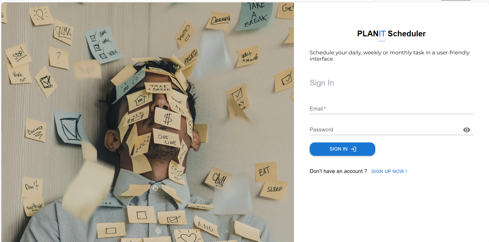
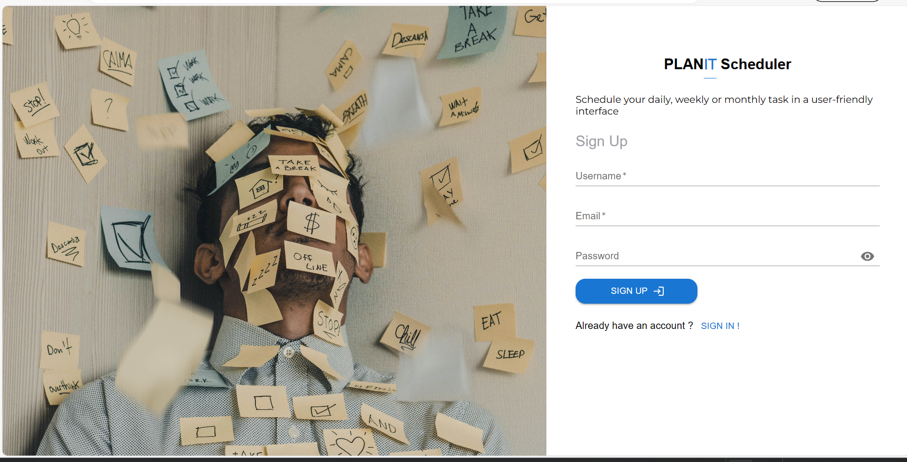

## PlanIt Task Scheduler

## About Project

Dynamic user task manager web application which allows users to schedule, track and manage their daily, weekly and monthly tasks in a easy and user-friendly interface.
[explore application](https://plan-it-task-scheduler.vercel.app/)

## Prerequisites

The client runs using npm and the api uses nuget packages. Api packages are already present in the
repository therefore no installation is required. However, some packages might be out-of-date and will need some update

To run the project follow the instructions below

## Install Node packages

You need NodeJS to run the command below. [Download NodeJS](https://nodejs.org/en/)

```bash
npm install 
```

## Run Client project

```bash
npm run dev
```

## Run Server [API]

1. Open Visual Studio
2. Open The Package manager console
3. Change connection string to your localhost server
4. Apply migrations to your database using the command below.

```bash
update-database 
```

This will create all necessary database tables using the initial migrations in the project.

5. Now build and run the solution. Your server should be up and running
            
## Technologies utilised

<div id="badges">
  
  
  
  
  
  
  
  
  
  
  
  
  
  
  
  
  
  
</div>

## Features

### Login 

Users can log onto the system using this login form



### Sign up

Users can create an account using this form



### Dashboard

The dashboard offers a lot of different features ranging from charts to task scheduling forms. 


### Actions

#### Add new task


#### Update task


#### Mark task as completed


#### View task details


### Task

users can schedule new task, update, view task details, delete, filter and search for task using on this page. 
The actions can be seen on the screenshots above


### Calender

Probably the most significant page on the web application. Enables users to keep track of the 
task they added and provide details of the task added on specific dates. Users can also 
navigate a "Gannt-like" page where they can keep track of their daily task.


### Daily Task - Gannt

Interesting Gannt-like UI showing daily scheduled task.


### Profile 

Displays user info and offers user authentication credential update and account deletion features.


## License 

This project is licensed under [`MIT`](LICENSE)

## Version 
1.0.0

### Site

[Explore application](https://plan-it-task-scheduler.vercel.app/)

